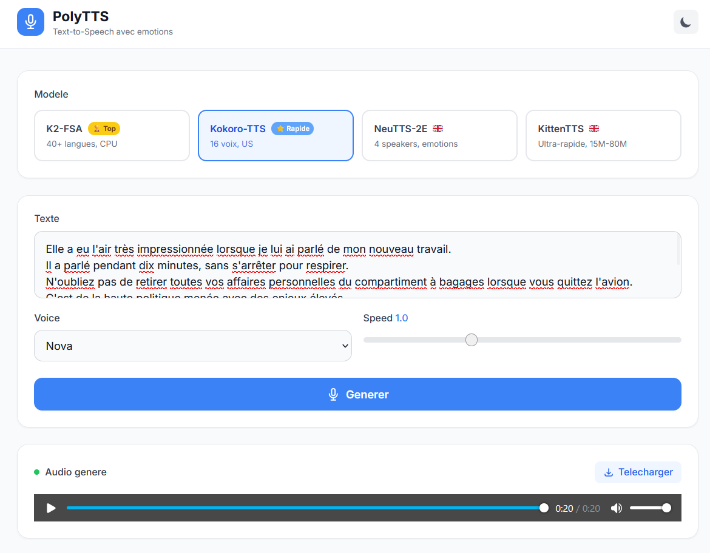

# PolyTTS



API Django REST pour du Text-to-Speech multi-modeles, avec frontend Tailwind CSS et dark mode.

PolyTTS permet de generer de la synthese vocale a partir de texte en choisissant parmi 4 modeles TTS differents, chacun avec ses propres langues, voix et caracteristiques.

| Modele | Langues | Voix | Infra |
|--------|---------|------|-------|
| **K2-FSA** | 40+ langues | — | CPU, sans limite |
| **Kokoro-TTS** | EN (US+UK) | 28 voix | CPU, sans limite |
| **NeuTTS-2E** | EN | 4 speakers, 7 emotions | ZeroGPU |
| **KittenTTS** | EN | 8 voix, 3 tailles | CPU |

## Installation

1. Cloner le depot :

```bash
git clone https://github.com/SimonMedy/PolyTTS.git
cd PolyTTS
```

2. Creer et activer un environnement virtuel :

```bash
python -m venv .venv
\.venv\Scripts\activate
```

3. Installer les dependances :

```bash
pip install -r requirements.txt
```

4. Creer un fichier `.env` a la racine avec le token HuggingFace :

```
HF_TOKEN=ton_token_hugging_face
```

Le token est requis pour l'acces aux HuggingFace Spaces. En creer un sur https://huggingface.co/settings/tokens

5. Appliquer les migrations :

```bash
python manage.py migrate
```

## Utilisation

Lancer le serveur :

```bash
python manage.py runserver 127.0.0.1:8000
```

Ouvrir http://127.0.0.1:8000/ dans un navigateur.

### Interface

- Choisir un modele TTS via les boutons en haut
- Entrer le texte a convertir
- Selectionner les options (langue, voix, vitesse, etc.)
- Cliquer sur "Generer" pour lancer la synthese
- Ecouter le resultat et le telecharger en WAV

### API

```
GET /say/?sentence=Bonjour&model=k2fsa&language=French
```

| Parametre | Description |
|-----------|-------------|
| sentence | Texte a convertir en audio |
| model | `k2fsa`, `kokoro`, `neutts`, `kitten` |
| language | K2-FSA : langue du texte |
| voice | Kokoro : voix (`af_heart`, `bf_emma`...) / NeuTTS : speaker / Kitten : voix |
| speed | Vitesse (0.5 - 2.0) |
| emotion | NeuTTS uniquement (`happy`, `sad`...) |
| model_size | KittenTTS : `Nano (15M)`, `Micro (40M)`, `Mini (80M)` |

Reponse : fichier WAV (audio/wav)

## Stack

- Django 5.2 + Django REST Framework
- gradio_client
- HuggingFace Spaces (K2-FSA, Kokoro, NeuTTS, KittenTTS)
- Tailwind CSS
